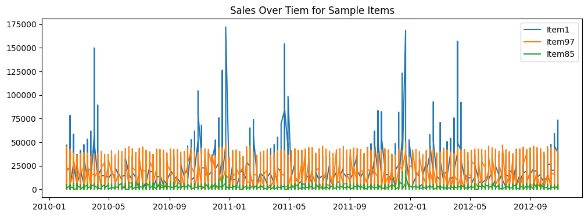
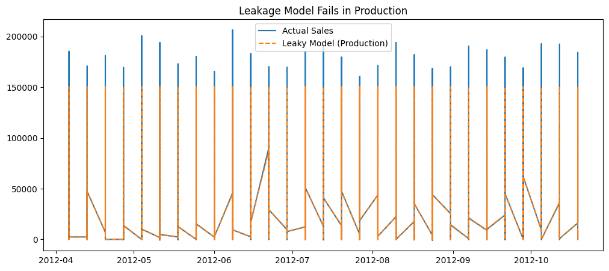
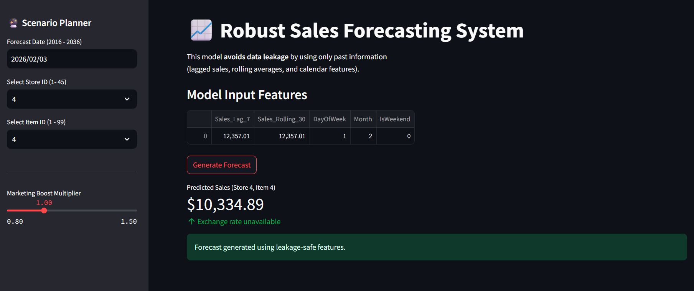

# Time-Travel-Trap
How I Built a 99% Accurate Model That Was Completely Useless — and Replaced It with a Production-Ready System

<p align="center">     </p> <p align="center"> <b>⚠️ High Accuracy ≠ Correct Model</b><br> This project demonstrates why. </p>


🚨 Why This Project Exists

Most machine learning models fail in production, not because the algorithm is weak —
but because the data pipeline is wrong.

This project demonstrates one of the most dangerous and common ML failures:

Data Leakage — when a model accidentally learns from the future.
Instead of avoiding this mistake,

✅ I intentionally created a leaky model
💥 Proved why its accuracy was an illusion
🛠️ Rebuilt a leakage-safe pipeline
🚀 Deployed a real forecasting system


🎯 Project Objective

Build a sales forecasting system that exposes one of the most dangerous ML failures — Data Leakage — and shows how to fix it properly.

What This Project Proves : 
Why random splits break time-series
Why future data contaminates models
Why evaluation can lie
How to design production-safe ML pipelines
How to deploy ML systems, not just notebooks

## 🏗️ Architecture Overview

```text
Raw Sales Data
      ↓
[ LEAKY PIPELINE ]
      ↓
🔥 99% Accuracy (Fake)
      ↓
❌ Fails in Production
      ↓
────────────────────────
      ↓
[ ROBUST PIPELINE ]
      ↓
Lag + Rolling + Calendar
      ↓
TimeSeriesSplit CV
      ↓
✅ Honest Performance
      ↓
🚀 Streamlit Deployment

## 🏗️ Repository Structure

```text
project-6-time-travel-trap/
│
├── data/
│   └── raw/
│       └── sales_data.csv
│
├── notebooks/
│   ├── 01_leaky_model_and_reality_check.ipynb
│   └── 02_robust_pipeline.ipynb
│
├── artifacts/
│   ├── xgboost_model.pkl
│   └── item_stats.csv
│
├── app.py
├── requirements.txt
└── README.md

📊 Dataset Description
Source: Walmart Store Sales (Time-Series Retail Data)

| Column      | Description        |
| ----------- | ------------------ |
| `Date`      | Time index         |
| `Store_ID`  | Store identifier   |
| `Item_ID`   | Product identifier |
| `Sales`     | Weekly sales       |
| `IsHoliday` | Holiday flag       |

Each (Store_ID, Item_ID) pair represents a real product evolving over time.

🚨 Phase 1 — The Lie (Leaky Model)
❌ Intentional Mistakes (On Purpose)
1️⃣ Target Leakage


Used global statistics that include future data.

2️⃣ Temporal Leakage

Used random train-test split:

"train_test_split(shuffle=True)"


This allows the model to learn from the future.


📈 Result (The Trap)

| Metric            | Value     |
| ----------------- | --------- |
| R² Score          | **~0.92** |
| Visual Fit        | Perfect   |
| Business Validity | ❌        |




💥 Phase 2 — Reality Check

Instead of forcing the score to drop artificially, this project proves a deeper truth:
Once leakage exists, evaluation itself becomes meaningless.
We cannot "fix" a leaky model — you must throw it away.

🛠️ Phase 3 — The  Fix (Robust Pipeline)
✅ Production Rules Enforced

✔ No future data
✔ No global statistics
✔ No random splits
✔ Past → Present → Future only

🧱 Leakage-Safe Feature Engineering

| Feature            | Description                   | Safe |
| ------------------ | ----------------------------- | ---- |
| `Sales_Lag_7`      | Sales from last week          | ✅   |
| `Sales_Rolling_30` | 30-day rolling mean (shifted) | ✅   |
| `DayOfWeek`        | Calendar feature              | ✅   |
| `Month`            | Seasonality                   | ✅   |
| `IsWeekend`        | Weekend indicator             | ✅   |

All rolling features are explicitly shifted to prevent future leakage.


⏱️ Validation Strategy
TimeSeriesSplit(n_splits=5)


Why this matters:

Preserves temporal order
Simulates real deploymemt
Prevents silent leakage


📊 Honest Performance (Cross - Validation)
| Fold | R²    |
| ---- | ----- |
| 1    | ~0.72 |
| 2    | ~0.86 |
| 3    | ~0.89 |
| 4    | ~0.85 |
| 5    | ~0.93 |


Interpretation:
Performance improves as more historical context becomes available —
exactly what a real forecasting system should show.

🚀 Phase 4 — Deployment (Streamlit)



The final model is deployed as a Scenario Planner, not just a predictor.

🔮 App Capabilities

Separate Store ID and Item ID selection
Forecast future dates
Apply marketing boost multiplier
Display exact model input features
Convert predictions to INR using live USD→INR rates

🧠 Deployment Design Decisions

Model and feature store saved separately
Rolling statistics precomputed (feature-store pattern)
Training and inference feature logic aligned
Exchange rates cached safely
This avoids one of the most common ML failures:
training–serving feature mismatch.

🧾 Production Artifacts

xgboost_model.pkl → trained model
item_stats.csv → last known rolling statistics

The app never recomputes historical features — it consumes trusted context, just like a real system.

📌 Project Status

✅ End-to-End Complete
✅ Leakage-Safe
✅ Production-Ready

🔮 Possible Extensions

Drift monitoring dashboard
User feedback loop for retraining
Feature store backed by a database
Scheduled retraining pipelines.

📝 License
This project is licensed under the MIT License - see the LICENSE file for details.


Thank You..
