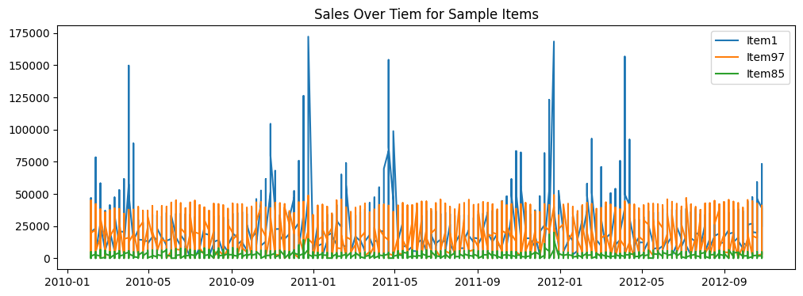
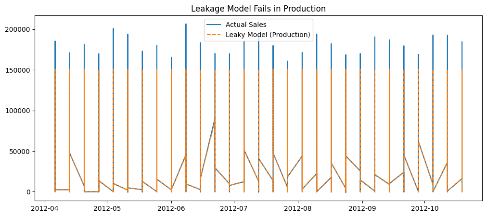
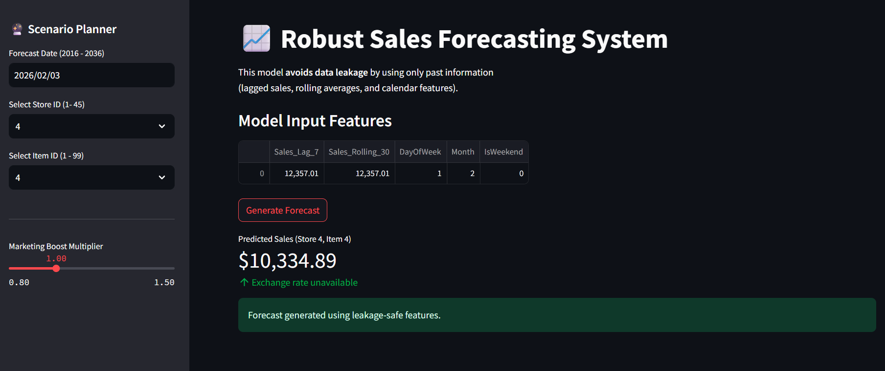

# Time-Travel-Trap

**How I Built a 99% Accurate Model That Was Completely Useless — and Replaced It with a Production-Ready System**

<p align="center">
  
  
  
  
  <a href="https://time-travel-trap.streamlit.app/"></a>
</p>

<p align="center">
  <b>⚠️ High Accuracy ≠ Correct Model</b><br>
  
</p>

---

## Why This Project Exists

Most machine learning models fail in production, not because the algorithm is weak — but because the data pipeline is wrong.

This project demonstrates one of the most dangerous and common ML failures: **Data Leakage** — when a model accidentally learns from the future.

Instead of avoiding this mistake:

✅ I intentionally created a leaky model  
 Proved why its accuracy was an illusion  
 Rebuilt a leakage-safe pipeline  
 Deployed a real forecasting system

---

## 🎯 Project Objective

Build a sales forecasting system that exposes one of the most dangerous ML failures — Data Leakage — and shows how to fix it properly.

### What This Project Proves

1. Why random splits break time-series
2. Why future data contaminates models
3. Why evaluation can lie

****This project is fully containerized, please refer to the Docker commands below.****

---

## 🏗️ Architecture Overview

```
Raw Sales Data
      ↓
[ LEAKY PIPELINE ]
      ↓
🔥 99% Accuracy (Fake)
      ↓
❌ Fails in Production
      ↓
────────────────────────
      ↓
[ ROBUST PIPELINE ]
      ↓
Lag + Rolling + Calendar
      ↓
TimeSeriesSplit CV
      ↓
  Honest Performance
      ↓
  Streamlit Deployment
```

---

## 📁 Repository Structure

```
project-6-time-travel-trap/
│
├── data/
│   └── raw/
│       └── sales_data.csv
│
├── notebooks/
│   ├── 01_leaky_model_and_reality_check.ipynb
│   └── 02_robust_pipeline.ipynb
│
├── artifacts/
│   ├── xgboost_model.pkl
│   └── item_stats.csv
│
├── app.py
├── requirements.txt
└── README.md
```

---

## 📊 Dataset Description

**Source:** Walmart Store Sales (Time-Series Retail Data)

**Link 👉**
[Click Here](https://www.kaggle.com/competitions/walmart-recruiting-store-sales-forecasting/data)

| Column      | Description        |
|-------------|-------------------|
| `Date`      | Time index        |
| `Store_ID`  | Store identifier  |
| `Item_ID`   | Product identifier|
| `Sales`     | Weekly sales      |
| `IsHoliday` | Holiday flag      |

Each `(Store_ID, Item_ID)` pair represents a real product evolving over time.

---

## 🚨 Phase 1 — The Lie (Leaky Model)

### ❌ Intentional Mistakes (On Purpose)

#### 1️⃣ Target Leakage


Used global statistics that include future data.

#### 2️⃣ Temporal Leakage

Used random train-test split:

```python
train_test_split(shuffle=True)
```

This allows the model to learn from the future.

### 📈 Result (The Trap)

| Metric            | Value     |
|-------------------|-----------|
| R² Score          | **~0.92** |
| Visual Fit        | Perfect   |
| Business Validity | ❌        |



---

## 💥 Phase 2 — Reality Check

Instead of forcing the score to drop artificially, this project proves a deeper truth:

**Once leakage exists, evaluation itself becomes meaningless.**

We cannot "fix" a leaky model — you must throw it away.

---

## 🛠️ Phase 3 — The Fix (Robust Pipeline)

### Given The Constraints

 No future data  
 No global statistics  
 No random splits  
 Past → Present → Future only

### 🧱 Leakage-Safe Feature Engineering

| Feature            | Description                   |
|--------------------|-------------------------------|
| `Sales_Lag_7`      | Sales from last week          | 
| `Sales_Rolling_30` | 30-day rolling mean (shifted) |
| `DayOfWeek`        | Calendar feature              |
| `Month`            | Seasonality                   | 
| `IsWeekend`        | Weekend indicator             |


###  Validation Strategy

```python
TimeSeriesSplit(n_splits=5)
```

**Why this matters:**

- Preserves temporal order
- Simulates real deployment
- Prevents silent leakage

###  Honest Performance (Cross-Validation)

| Fold | R²    |
|------|-------|
| 1    | ~0.72 |
| 2    | ~0.86 |
| 3    | ~0.89 |
| 4    | ~0.85 |
| 5    | ~0.93 |

**Interpretation:** Performance improves as more historical context becomes available.

---

## 🚀 Phase 4 — Deployment (Streamlit)



The final model is deployed as a **Scenario Planner**, not just a predictor.

###  App Capabilities

- Separate Store ID and Item ID selection
- Forecast future dates
- Apply marketing boost multiplier
- Display exact model input features
- Convert predictions to INR using live USD→INR rates

### 🧠 Deployment Design Decisions

- Model and feature store saved separately
- Rolling statistics precomputed (feature-store pattern)
- Training and inference feature logic aligned
- Exchange rates cached safely

This avoids one of the most common ML failures: **training–serving feature mismatch**.

### 🧾 Production Artifacts

- `xgboost_model.pkl` → trained model
- `item_stats.csv` → last known rolling statistics

The app never recomputes historical features — it consumes trusted context.

---

## Deployment Notes

**🌐 Live Demo:** [Sales Forecaster on Streamlit](https://time-travel-trap.streamlit.app)

This project is deployed as a production-safe forecasting system, not just a trained model.

* The trained model (`xgboost_model.pkl`) and historical feature store (`item_stats.csv`) are saved separately to ensure training–serving consistency.
* At inference time, the application recreates only leakage-safe features (lagged trends, rolling statistics, and calendar features).
* No future data or global statistics are accessed during prediction.
* The Streamlit app serves as a scenario planner, allowing controlled "what-if" adjustments without retraining the model.
* Live USD → INR conversion is fetched safely and cached, with graceful fallback on failure.

---


## ▶️ Running the App Locally


1. **Clone the repository**
   ```bash
   git clone [LINK](https://github.com/Shreyas-S-809/Time-Travel-Trap-)
   cd Time-Travel-Trap
   ```

2. **Initialize and Activate Virtual Environment**
   ```powershell
   # Create environment
   python -m venv en

   # Activate (Windows)
   en\Scripts\activate
   ```

3. **Install Dependencies**
   ```bash
   pip install -r requirements.txt
   ```

4. **Run the Application**
   ```bash
   streamlit run app.py
   ```


5. **OR Run it using Docker**

First, pull the latest image:

   ```bash
   docker pull shreyas809/time-travel-trap:latest
   ```
Next, Start the container. Make sure to map the ports correctly to `8501`

  ```bash
  docker run -p 8501:8501 shreyas809/time-travel-trap:latest
  ```
Once the container is running, open your web browser and navigate to:
  http://localhost:8501

> _(Note: The terminal might output a link to `0.0.0.0.:8501`. If you are windows, Browsers cannot route to `0.0.0.0`, so always use `localhost` instead!)._
---

All heavy ML computation is already done — the app loads instantly.

---

## 🔮 Possible Extensions

- Drift monitoring dashboard
- User feedback loop for retraining
- Feature store backed by a database
- Scheduled retraining pipelines

---

## 📝 License

This project is licensed under the MIT License - see the LICENSE file for details.

---

**Thank You!**
